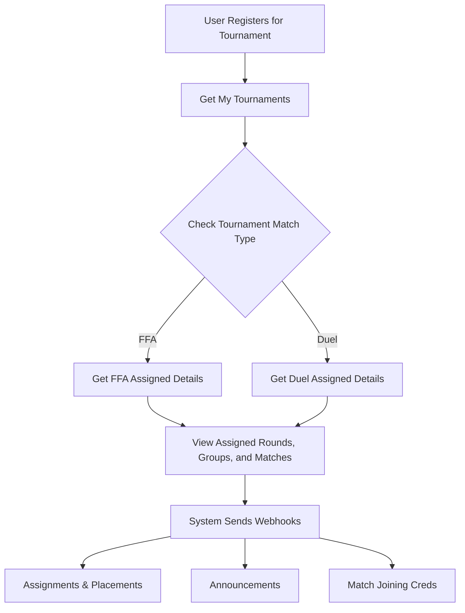

Once a user has successfully registered for a tournament, there are several steps and API endpoints involved in keeping them updated about their matches, groups, and rounds.

## Registered Tournaments

To get a list of the tournaments a user is currently registered in, use the **Get My Tournaments** endpoint.

<Card title="Get My Tournaments" icon="trophy" href="/api-reference/get-my-tournaments">
  Retrieve the list of tournaments the user has joined.
</Card>

## Tournament Assignments

After listing the tournaments, you can access detailed information about the user's specific assignments, such as which round or group they have been assigned to. 

Depending on the **Match Type** of the tournament, you will use different endpoints:

### 1. Free-For-All (FFA) Tournaments

For FFA tournaments, you get a list of rounds, groups, and matches assigned to the user, along with the scheduled time and date. You can also show the list of participants for that specific group or match using the FFA assigned details endpoint. Filters are also available.

<Card title="Get FFA Assigned Details" icon="users" href="/api-reference/get-ffa-assigned-details">
  Fetch assigned details for FFA tournaments, including groups and matches.
</Card>

### 2. Duel Tournaments

For DUEL tournaments, you retrieve the list of rounds and matches the user is assigned to, including scheduled time. You can also display the list of participants for that match.

<Card title="Get Duel Assigned Details" icon="swords" href="/api-reference/get-duel-assigned-details">
  Fetch assigned details for Duel tournaments.
</Card>

***

## Announcements and Webhooks

To keep users informed in real-time about assignments and announcements, 16TMS provides comprehensive webhooks. You can listen to these events to interact with your users immediately. For example, upon receiving webhook events you can:
- **Post real-time notifications** using WebSockets.
- **Open modal notifications** directly in your app's UI.
- **Trigger SMTP emails** indicating new rounds or schedules.
- **Send mobile push notifications** alerts to users.

### Announcement Webhooks
We offer webhook events for announcements sent at different levels:
- `match.announcement` — Announcement to a specific match
- `group.announcement` — Announcement to a group
- `round.announcement` — Announcement to an entire round
- `tournament.announcement` — Tournament-wide announcement

### Assignment & Credentials Webhooks
Similarly, you will receive webhook events for:
- Whenever any team is assigned to a round, group, or match.
- **Match Joining Credentials**, allowing participants to securely receive the credentials needed to enter the actual game server.

For more details on webhooks, please see the [Webhook Events](/webhooks/events-and-payloads) documentation.

***

## Flowchart

Here is a typical flow of data after registration:

## Example UI / Flow

*(Below are placeholder examples of Mobile UI screens you can build for users)*

<Frame>
  
</Frame>

<Frame>
  
</Frame>

