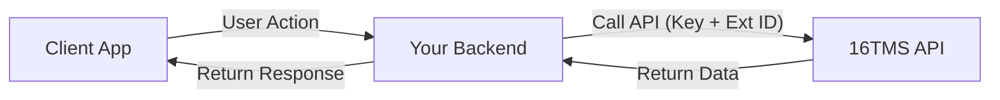

16TMS is designed to work as a backend-to-backend service. Your backend acts as the bridge between your users (the client) and the 16TMS platform. This ensures security and allows you to maintain full control over the user experience.

## Architecture

1.  **Client (User)**: Your mobile app or website.
2.  **Your Backend**: The server that manages your application logic and holds your API keys.
3.  **16TMS API**: The esports engine providing tournament functionality.

## Data Flow

When a user performs an action (like viewing tournaments or joining a team), the request flows through your backend.

### Workflow Steps

1.  **User Request**: The user initiates an action on your client (e.g., "Join Tournament").
2.  **Client Request**: Your client sends a request to **Your Backend**.
3.  **16TMS API Call**: Your backend makes a request to the **16TMS API**.
    *   **Authentication**: Include your `X-API-KEY` header.
    *   **User Context**: Pass the user's `externalId` (the unique ID you generated) in the query parameters or body to tell 16TMS which user is performing the action.
4.  **Response**: 16TMS processes the request and returns the data to your backend.
5.  **Final Response**: Your backend sends the final response back to the user's client.

## Diagram

## Security Note

<Warning>
  Never expose your **X-API-KEY** in your client-side code (frontend/mobile app). Always keep it secure on your backend server.
</Warning>
