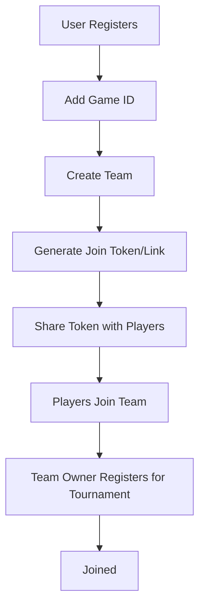
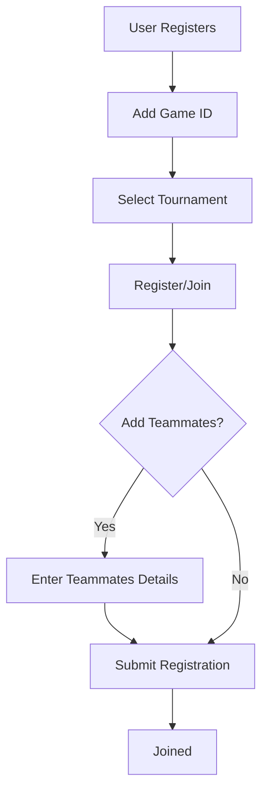

There are two primary types of tournament registration flows: Team-based and Solo/Direct. This guide details the steps for each to help you integrate them into your platform.

## Type 1: Team Registration Flow

This flow is designed for team-based tournaments where a captain creates a team and other members join before registering for the tournament.

### Workflow

1.  **User Registration**: The user registers on your platform.
2.  **Add Game ID**: The user links their In-Game Name (IGN) or Game ID to their profile.
3.  **Create Team**: The user creates a new team.
4.  **Invite Members**:
    *   A unique **Team Join Token** or link is generated.
    *   The user shares this token/link with other players.
    *   Other players use the token to join the team.
5.  **Register for Tournament**:
    *   The Team Owner (Captain) registers the team for the tournament.
    *   **Status**: The team is now successfully **Joined**.

### Diagram

## Type 2: Solo / Direct Registration Flow

This flow is strictly for solo players or scenarios where the user registers directly without creating a persistent team entity first.

### Workflow

1.  **User Registration**: The user registers on your platform.
2.  **Add Game ID**: The user links their In-Game Name (IGN) or Game ID.
3.  **Register for Tournament**: The user directly registers for the tournament.

### Variation: Ad-hoc Team Registration

In some cases, a user might register a squad directly during the tournament join process without pre-creating a team.

1.  **User Starts Registration**: User clicks "Join Tournament".
2.  **Add Teammates**: During the checkout/join phase, the user inputs the details (Game IDs/Emails) of other players.
3.  **Confirm Registration**: The user submits the registration.
4.  **Joined**: The group is registered for the tournament.

### Diagram

