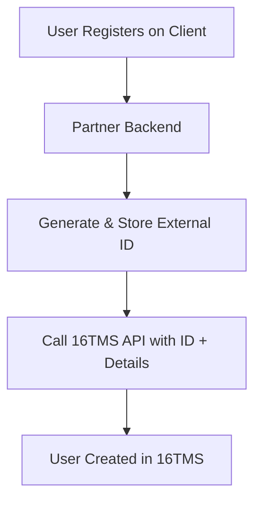

16TMS is designed to integrate seamlessly with your existing user management system. Instead of requiring users to create separate accounts, you map your existing users to 16TMS using your own unique identifiers.

## Workflow

1.  **User Registration**: The user registers or signs up on your platform (your backend).
2.  **Generate & Store Identifier**: Your backend generates a unique `externalId` for this user and saves it in your database.
3.  **Sync with 16TMS**: Your backend immediately calls the 16TMS API using this `externalId` along with other user details (like username, avatar).
    *   This is done via the **[Register a new user](/api-reference/register-a-new-user)** endpoint.
    *   You must include your `X-API-KEY` in the header for authentication.
4.  **Subsequent Access**: For all future API requests related to this user (e.g., joining tournaments, fetching matches), you will use:
    *   Your **API Key** (for authorization).
    *   The **External ID** (the unique token/ID you generated) to identify the specific user.

## Flowchart

## api-reference

<Card title="Register a new user" icon="user-plus" href="/api-reference/register-a-new-user">
  Create or update a user profile in 16TMS using your external specific ID.
</Card>
