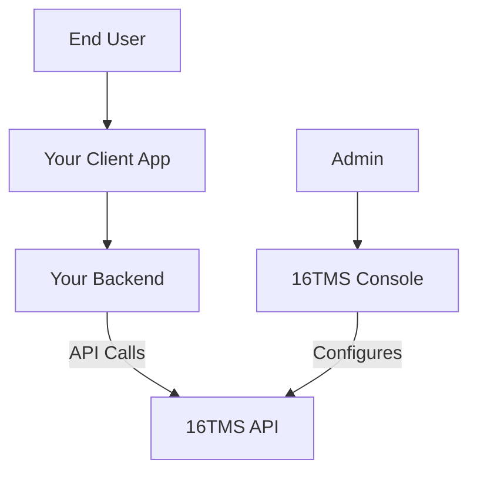

Understanding how 16TMS fits into your ecosystem.

## High-Level Diagram

1.  **Console**: Used by admins to configure games, tournaments, and view data.
2.  **API**: Your backend communicates with our API to register users, teams, and fetch tournament data.
3.  **Client**: Your user interface displays the data fetched by your backend.
