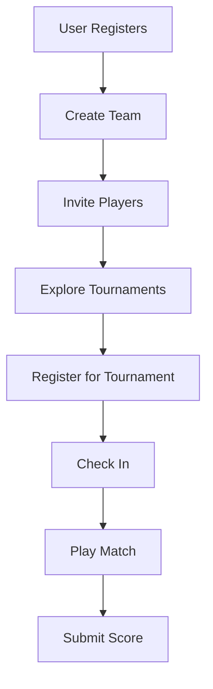

# Integration Flow

This flowchart illustrates the typical user journey and how your system interacts with 16TMS.

## User Journey

1.  **User Registration**: User registers on your platform.
2.  **Create Team**: User creates a team.
3.  **Invite Players**: User invites other players to the team.
4.  **Register Tournament**: Team captain registers for a tournament.

## Flowchart

## Detailed Steps

### 1. User Registration
CALL `POST /users` ...

### 2. Team Creation
CALL `POST /teams` ...
